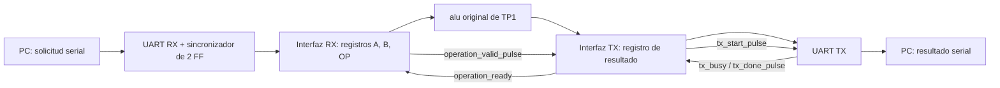

# TP2: UART e integración con la ALU

El TP2 recibe una operación desde una PC por UART, carga operandos y operación
en registros, calcula con la ALU original del TP1 y transmite automáticamente
un byte de resultado. Esta etapa contiene fuentes y bancos de simulación para
trabajar desde la terminal de Visual Studio Code.

También está disponible la [calculadora de escritorio en Python](pc/README.md),
con teclado numérico y botones para las ocho operaciones de la ALU. Se inicia con
`python TP2/pc/calculator.py` desde la raíz y utiliza el mismo protocolo a 9600
baud. La prueba física requiere programar previamente la FPGA.

**Estado de validación:** implementación y testbenches preparados. Se intentó
ejecutar la batería el 13/09/2026, pero no están disponibles `iverilog`, `vvp`
ni Yosys en este entorno. Las simulaciones y la comprobación estructural están
**pendientes**, no aprobadas. No se instaló software ni se ejecutó Vivado.

## Archivos y arquitectura

```text
repositorio/
├── .gitignore                         # Excluye TP2/build/
├── README.md                          # Índice de trabajos
├── TP1/                               # Archivos originales, sin cambios
│   └── src/alu.v                      # Única implementación de la ALU
└── TP2/
    ├── README.md
    ├── src/                           # Exclusivamente RTL sintetizable
    │   ├── baud_rate_generator.v
    │   ├── reset_sync.v
    │   ├── uart_rx.v
    │   ├── uart_tx.v
    │   ├── rx_interface_fsm.v
    │   ├── tx_interface_fsm.v
    │   └── tp2_top.v
    ├── sim/                           # Exclusivamente verificación
    │   ├── tb_helpers.vh
    │   ├── baud_rate_generator_tb.v
    │   ├── uart_tx_tb.v
    │   ├── uart_rx_tb.v
    │   ├── interface_tb.v
    │   └── tp2_top_tb.v
    ├── scripts/
    │   └── simulate.py
    ├── pc/                            # Calculadora Python y sus pruebas
    │   ├── calculator.py
    │   ├── protocol.py
    │   ├── serial_client.py
    │   ├── requirements.txt
    │   ├── README.md
    │   └── tests/test_calculator.py
    └── build/                         # Generado por el script; ignorado por Git
        └── results.json               # Estado real de la última ejecución
```

Los `.vvp`, logs y el archivo opcional `check.ys` también se generan en `build/`
cuando están disponibles las herramientas. El script resuelve las rutas a partir
de su propia ubicación y no depende del directorio desde el que se lo invoque.



Todos los registros internos usan el mismo flanco ascendente de `clk`.
`tick_16x` es una habilitación de un ciclo, nunca un reloj derivado.

| Módulo | Responsabilidad |
|---|---|
| `baud_rate_generator` | Divide el clock y genera `tick_16x`; parámetros `CLK_FREQ` y `BAUD_RATE`. |
| `reset_sync` | Propaga la activación del reset y sincroniza su liberación mediante dos registros. |
| `uart_rx` | Sincroniza RX con dos FF, valida start/stop y entrega `rx_data`, `rx_valid_pulse` y `frame_error`. |
| `uart_tx` | Registra el dato al aceptar start y transmite una trama completa; entrega busy y done. |
| `rx_interface_fsm` | Reconoce `CD`, carga A/B/OP, valida OP y avisa a la interfaz TX. |
| `tx_interface_fsm` | Espera un ciclo tras aceptar la operación, registra el resultado y controla TX mediante handshakes. |
| `tp2_top` | Instancia y conecta los seis módulos y la ALU original; no contiene FSM. |

Los puertos de `tp2_top` son `clk`, `reset`, `serial_rx`, `serial_tx`,
`frame_error` y `protocol_error`. Los dos últimos son pulsos de diagnóstico de
un ciclo de clock; no son bytes adicionales en la respuesta ni indicadores
persistentes para LED.

## Protocolo y operaciones

```text
Solicitud: CD A B OP       (cuatro bytes binarios)
Respuesta: RESULTADO      (un byte binario)
Ejemplo:   CD 05 0A 20 -> 0F
```

Enviar bytes reales, no los caracteres ASCII de `"CD 05 0A 20"`.
Los operandos pueden contener cualquier byte, incluido `CD`. El receptor
interpreta `CD` como comando únicamente en `S_WAIT_CMD`. No implementa `D1`.

`OP[7:6]` debe ser `00`; `OP[5:0]` se conecta directamente a la ALU.
Un byte OP con bits superiores no nulos se descarta, genera `protocol_error`
y no produce respuesta. Un código de seis bits no implementado conserva el
comportamiento original de la ALU: responde `00`.

| Operación | Byte OP | Resultado de 8 bits | Ejemplo |
|---|---|---|---|
| ADD | `20` | `a + b`, truncado a 8 bits | `05 + 0A = 0F` |
| SUB | `22` | `a - b`, truncado a 8 bits | `05 - 0A = FB` |
| AND | `24` | `a & b` | `CC & AA = 88` |
| OR | `25` | `a \| b` | `CC \| AA = EE` |
| XOR | `26` | `a ^ b` | `CC ^ AA = 66` |
| SRA | `03` | `$signed(a) >>> b` | `CC >>> 2 = F3` |
| SRL | `02` | `a >> b` | `CC >> 2 = 33` |
| NOR | `27` | `~(a \| b)` | `~(CC \| AA) = 11` |

`b` completo determina la cantidad de desplazamientos, incluso cuando supera
7; no se limita a sus tres bits inferiores. Los negativos se envían en
complemento a dos. La UART no interpreta el signo.

La PC debe enviar una solicitud y esperar su respuesta completa antes de enviar
la siguiente. Los cuatro bytes de una solicitud pueden llegar consecutivamente,
con un solo stop entre tramas. No hay FIFO ni cola de operaciones: un comando
recibido mientras la interfaz TX está ocupada se ignora. La interfaz espera
`tx_done_pulse`, sin usar retardos arbitrarios.

Un error de stop aborta la solicitud parcial. RX emite un solo `frame_error` y
espera que la línea vuelva a 1, para evitar interpretar un nivel bajo prolongado
como nuevas tramas. `rx_data` conserva el último byte válido, pero **no** vuelve
a emitir `rx_valid_pulse`; las interfaces consumen datos únicamente con ese pulso.
Después de recuperar la línea, la PC debe reenviar una solicitud completa.

No hay timeout de solicitud ni checksum. Una solicitud interrumpida sin error
UART permanece esperando el siguiente campo hasta recibirlo o hasta un reset.
Un nuevo `CD` dentro de A/B es un dato y no puede resincronizar esa solicitud.

## Formato UART, clock y reset

- Clock predeterminado: **100 MHz**.
- Baud solicitado: **9600**.
- Formato: **8N1**, un start bajo, ocho datos LSB primero, un stop alto, sin paridad.
- Sobremuestreo: **16×**, con validación en el centro de cada bit.
- Reposo de RX y TX: **1**.
- Reset externo e interno: **activo en alto**.

```text
DIVISOR = floor(CLK_FREQ / (BAUD_RATE × 16))
        = floor(100000000 / (9600 × 16)) = 651
BAUD_REAL = 100000000 / (651 × 16) = 9600,6144 baud
Error relativo: aproximadamente +0,0064 %
Duración real de un bit: 10416 ciclos = 104,16 µs
```

El contador utiliza `max(1, $clog2(DIVISOR))` bits. Se admite
`CLK_FREQ > 0`, `BAUD_RATE > 0` y `DIVISOR >= 1`; no se deben usar
configuraciones que den divisor cero. La división entera se expresa en dos pasos
para evitar el desbordamiento del producto `BAUD_RATE * 16`.
Con divisor 1, cada ciclo está habilitado y `tick_16x` permanece alto fuera de
reset: son habilitaciones consecutivas. Con divisor mayor que 1 los pulsos están
separados por ciclos en cero.

`uart_rx`, `uart_tx` y `tx_interface_fsm` exponen `DATA_BITS` (predeterminado 8,
mínimo 1). Sus contadores contemplan también ancho 1. El protocolo del top y su
interfaz RX están fijados a bytes de 8 bits; cambiar el ancho de un núcleo UART
aislado no redefine el protocolo. El top expone `CLK_FREQ` y `BAUD_RATE`.

`reset_sync` exige mantener el reset externo alto durante al menos un flanco
ascendente de `clk`. La activación llega directamente a `reset_internal`; los
registros consumidores se limpian en un flanco de `clk`. La liberación atraviesa
dos FF y los consumidores reanudan su funcionamiento en el flanco siguiente.
Esto no es un capturador de pulsos de reset menores que un período ni un
antirrebote para botones. La línea RX tiene su propio sincronizador de dos FF.

Todos los registros de RTL tienen reset explícito. Las salidas de pulso quedan
en cero y TX en uno durante reset. No hay inicializaciones de registros en sus
declaraciones, bloques `initial` ni retardos `#` de simulación en `src/`.

## Máquinas de estados y temporización

Cada FSM usa `localparam`, `state`, `next_state`, valores combinacionales por
defecto y `case` con `default` que vuelve al estado inicial. Las asignaciones
secuenciales son no bloqueantes y las combinacionales son bloqueantes.

| FSM | Recorrido y recuperación |
|---|---|
| RX UART | `IDLE → START → DATA → STOP → DONE → IDLE`. START comprueba el nivel al octavo tick; los datos y stop se muestrean cada 16 ticks. Un falso start vuelve a IDLE. Un stop bajo lleva a `ERROR → WAIT_HIGH → IDLE`. |
| TX UART | `IDLE → ALIGN → START → DATA → STOP → DONE → IDLE`. ALIGN espera el siguiente tick antes de bajar TX: el start, cada dato y el stop duran exactamente 16 intervalos de tick completos. |
| Interfaz RX | `WAIT_CMD → WAIT_A → WAIT_B → WAIT_OP → LOAD → WAIT_CMD`. Los campos avanzan únicamente con `rx_valid_pulse`; LOAD y ERROR duran un ciclo. OP inválido pasa por ERROR; un error de trama aborta hacia WAIT_CMD. |
| Interfaz TX | `IDLE → CAPTURE_RESULT → WAIT_READY → START_TX → WAIT_TX_DONE → DONE → IDLE`. CAPTURE_RESULT reserva el ciclo de estabilización y captura al salir. WAIT_READY espera `!tx_busy`, START_TX pulsa una vez y WAIT_TX_DONE espera `tx_done_pulse`. |

Las salidas Moore `rx_valid_pulse`, `operation_valid_pulse`, `tx_start_pulse` y
`tx_done_pulse` duran un ciclo. Los estados inválidos no generan pulsos y recuperan
el inicial en el siguiente clock, según la lógica RTL. Los testbenches fuerzan
`3'b111` en las cuatro FSM y verifican esa recuperación y operaciones posteriores.
La implementación física y las decisiones de recodificación de FSM deberán
comprobarse en la etapa de síntesis con Vivado.

Secuencia desde el byte OP válido:

1. La interfaz RX registra OP y entra en LOAD; A, B y OP alimentan la ALU.
2. En el próximo flanco, la interfaz TX acepta `operation_valid_pulse` y entra
   en CAPTURE_RESULT.
3. Tras un ciclo completo, captura `alu_result` en `tx_data`.
4. Espera disponibilidad, pulsa start y conserva `tx_data` hasta finalizar TX.

Los estados START/DATA/STOP están separados para poder incorporar un estado de
paridad en una etapa posterior; no se implementó paridad en esta versión.

## Reutilización de TP1

Se inspeccionaron completos `TP1/src/alu.v`, `TP1/src/alu_testbench.v`,
`TP1/src/basys3_top.v` y `TP1/INFORME.md`. No había instrucciones `AGENTS.md`,
scripts, tareas VS Code, PDF de FSM ni TP aprobado de referencia en el repositorio.

La interfaz real del módulo `alu` es:

```verilog
parameter N_DATA = 8;
parameter N_OP = 6;
// Entradas: a[N_DATA-1:0], b[N_DATA-1:0], op[N_OP-1:0]
// Salidas:  res[N_DATA-1:0], zero, overflow, carry_out
```

Es combinacional y no tiene clock ni reset. El top instancia `alu` directamente,
con `N_DATA=8` y `N_OP=6`. Los flags originales existen y quedan desconectados
en TP2 porque el protocolo responde solamente el resultado. No se agregó un
wrapper ni otra ALU. El comando de compilación incluye `TP1/src/alu.v` como
unidad fuente, sin usar un `` `include`` de ese archivo.

## Ejecución desde Visual Studio Code

Herramientas necesarias: **Python 3.9 o posterior** e **Icarus Verilog**, con
`iverilog` y `vvp` en PATH. **Yosys** es opcional para la comprobación estructural.
No se requieren paquetes de pip, extensiones de VS Code ni Vivado para simular.
La instalación de las herramientas se realiza por separado; el script no instala
software ni cambia PATH.

1. Abrir la carpeta raíz del repositorio en VS Code.
2. Elegir **Terminal → New Terminal** (Terminal → Nueva terminal).
3. En PowerShell, situado en la raíz, ejecutar:

```powershell
python TP2/scripts/simulate.py
```

Ejecuta los cinco bancos de TP2 y el testbench original de la ALU. Para incluir
la prueba serial completa con los parámetros nominales de placa:

```powershell
python TP2/scripts/simulate.py --nominal
```

Otras opciones:

```powershell
# Un banco aislado
python TP2/scripts/simulate.py --bench uart_rx_tb

# Listar los comandos exactos sin ejecutar ni necesitar simulador
python TP2/scripts/simulate.py --nominal --list

# Bateria completa y comprobacion estructural opcional con Yosys
python TP2/scripts/simulate.py --nominal --lint

# Si Icarus esta instalado fuera de PATH (ajustar estas rutas)
python TP2/scripts/simulate.py --iverilog 'C:\iverilog\bin\iverilog.exe' --vvp 'C:\iverilog\bin\vvp.exe'
```

También se puede usar `py -3` en lugar de `python`. Cada banco propio imprime
`PASS` o `FAIL`, un resumen de comprobaciones y termina; un fallo produce
`$fatal(1, ...)`. Todos tienen watchdog para detectar esperas que no terminan.
El runner continúa con los demás bancos si uno falla y devuelve código distinto
de cero ante fallos o herramientas ausentes. Detecta además el mensaje de éxito
del testbench original de TP1, que no utiliza `$fatal`.

Ejemplo manual equivalente para el sistema completo, desde la raíz:

```powershell
New-Item -ItemType Directory -Force TP2/build | Out-Null
iverilog -g2012 -Wall -Wno-timescale -I TP2/sim -s tp2_top_tb -o TP2/build/tp2_top_tb.vvp TP1/src/alu.v TP2/src/baud_rate_generator.v TP2/src/reset_sync.v TP2/src/uart_rx.v TP2/src/uart_tx.v TP2/src/rx_interface_fsm.v TP2/src/tx_interface_fsm.v TP2/src/tp2_top.v TP2/sim/tp2_top_tb.v
vvp TP2/build/tp2_top_tb.vvp
```

Se desactiva únicamente el warning de `timescale`: TP1 no lo declara y su fuente
se conserva intacta. Las fuentes propias sí lo declaran. `-g2012` admite las
utilidades de verificación de los bancos; el RTL se escribió en Verilog con
construcciones sintetizables, como `$clog2` para constantes de elaboración.

## Pruebas y resultados

| Banco o chequeo | Cobertura preparada | Resultado de esta entrega |
|---|---|---|
| `baud_rate_generator_tb` | Reset, intervalos de 4 y 651 ciclos, pulsos, divisor 1 y reinicio a mitad de cuenta. | NOT RUN: faltan Icarus/vvp |
| `uart_tx_tb` | `00`, `FF`, `55`, `AA`, `93`; verifica cada ciclo de los 10 bits, busy, done, dato registrado, start ocupado, reset y estado inválido. | NOT RUN: faltan Icarus/vvp |
| `uart_rx_tb` | Bytes consecutivos, fase asíncrona, falso start, stop inválido, break prolongado, pulsos, recuperación, reset y estado inválido. | NOT RUN: faltan Icarus/vvp |
| `interface_tb` | Ejemplo de protocolo, los 14 vectores del TP1, CD en operandos, desplazamientos 0/8/255, OP inválido/default, captura diferida, espera busy/done, abortos y dos estados inválidos. | NOT RUN: faltan Icarus/vvp |
| `tp2_top_tb` | Solicitudes seriales sin pausas entre bytes, 16 respuestas reconstruidas, ocho operaciones, errores de trama/protocolo y reset de solicitud parcial. | NOT RUN: faltan Icarus/vvp |
| `alu_testbench` | Regresión original de TP1, sin editar su archivo. | NOT RUN: faltan Icarus/vvp |
| `tp2_top_tb_nominal` | Mismo banco a 100 MHz / 9600 baud con tiempos del emisor independientes del divisor. | NOT RUN: faltan Icarus/vvp |
| Yosys `check -assert` y ausencia de `$dlatch` | Elaboración de jerarquía, conflictos de drivers y latches inferidos. | NOT RUN: falta Yosys |

La configuración rápida del banco superior es 100 MHz / 1 562 500 baud: divisor
4, 64 clocks por bit y 640 ns por bit. No se altera el período de una trama para
acomodar errores del diseño. El emisor y el decodificador del banco usan
`1e9 / BAUD_RATE` nanosegundos; la prueba nominal permite comprobar también el
redondeo entero del generador.

Se revisó estáticamente que los bloques combinacionales asignan todas sus salidas,
cada registro tiene un único bloque escritor y cada FSM tiene recuperación por
`default`. Esta revisión no sustituye una compilación, una simulación ni un
informe de síntesis. No hay resultados PASS ni ausencia de warnings de compilación
confirmados hasta ejecutar las herramientas. `TP1` no presenta cambios y existe
una única definición del módulo `alu`. No se generaron proyectos, constraints,
bitstreams ni directorios de Vivado.

## Próxima etapa: integración con Vivado

Estos pasos se realizarán posteriormente, después de completar la simulación:

1. Crear el proyecto para Basys 3.
2. Agregar todos los archivos de `TP2/src` como fuentes de diseño.
3. Agregar el archivo original `TP1/src/alu.v` mediante su ubicación original.
4. Seleccionar `tp2_top` como top y mantener 100 MHz / 9600 baud.
5. Agregar el XDC con clock, reset, UART y el tratamiento correspondiente de
   los dos puertos de diagnóstico; revisar también las restricciones de CDC.
6. Agregar los bancos de `TP2/sim` como fuentes de simulación y simular en Vivado.
7. Ejecutar síntesis y revisar latches, drivers, sincronizadores y recuperación
   de FSM; verificar las decisiones de recodificación y protección de estados.
8. Ejecutar implementación y comprobar temporización.
9. Generar el bitstream.
10. Probar la comunicación serial con la placa usando bytes binarios a 9600 8N1.

No agregar `TP1/src/basys3_top.v` ni `TP1/src/alu_testbench.v` como fuentes de
diseño de este top. Tampoco agregar archivos de `sim/` o `build/` como RTL.
Ninguno de estos pasos de Vivado se realizó en esta etapa.
