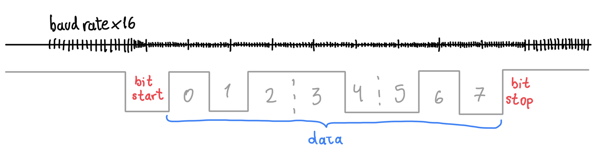
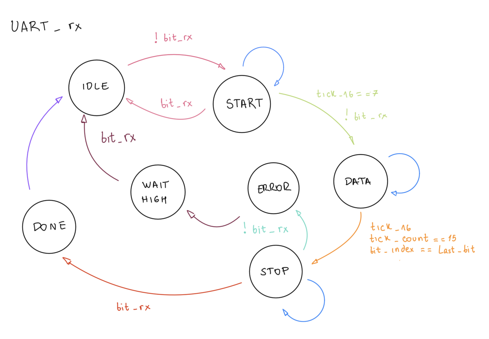
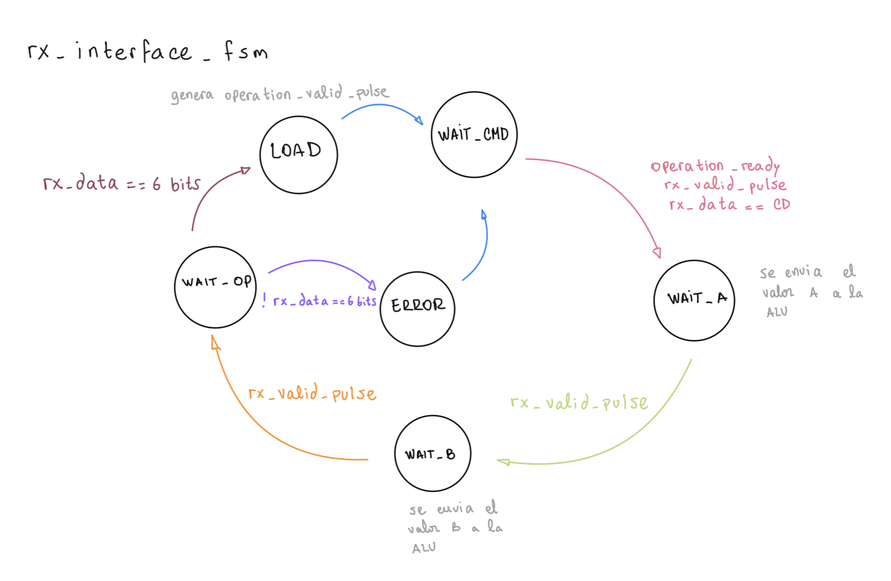
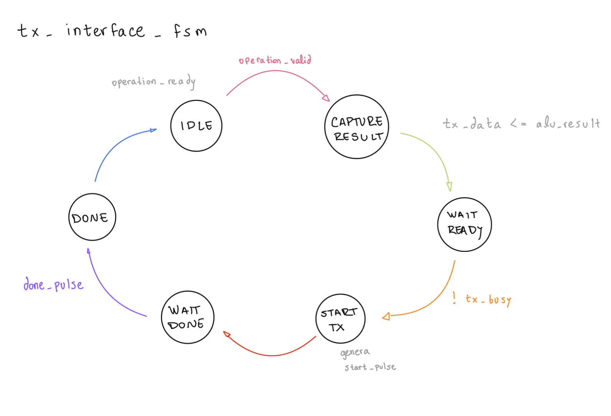
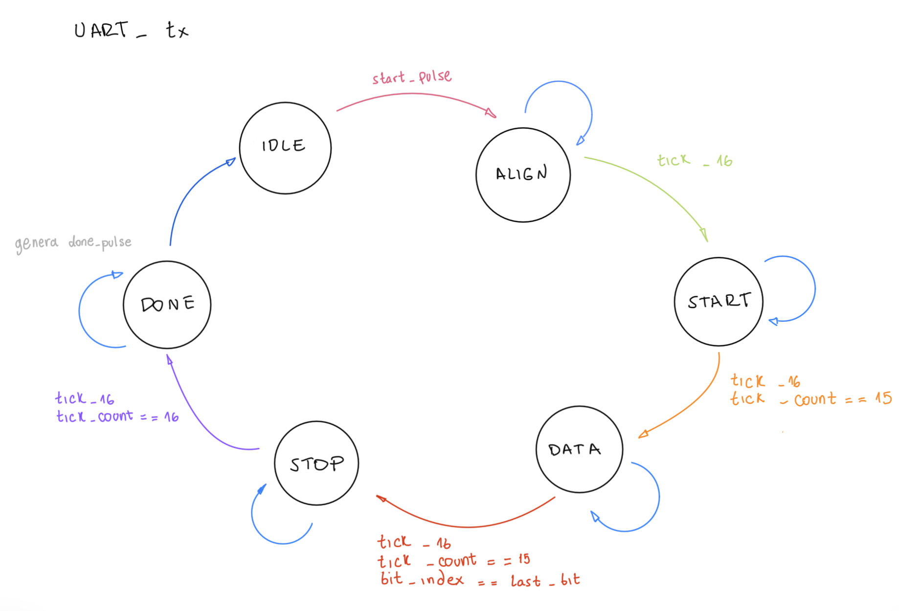
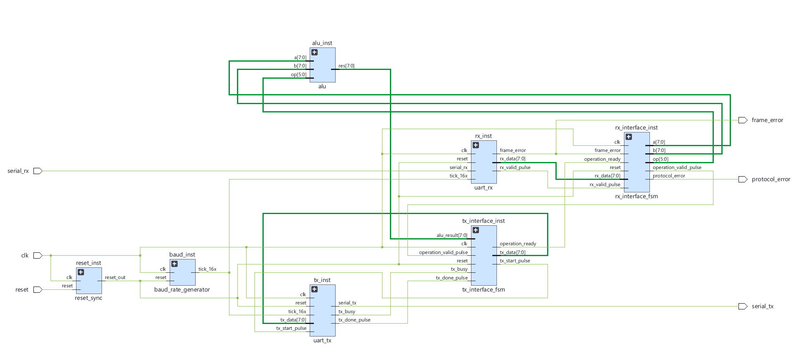

# TP2: comunicación UART entre una PC y una FPGA

## 1. Introducción y objetivo

En este trabajo desarrollamos un sistema de comunicación que permite enviar operandos y seleccionar una operación desde una computadora, realizar el procesamiento en una FPGA Basys 3 y recibir el resultado en la misma computadora. Para ello implementamos una UART, las interfaces de control necesarias para conectarla con la ALU del TP1 y una aplicación gráfica en Python.

El objetivo fue implementar una comunicación serial asíncrona entre la PC y la FPGA mediante UART, utilizando dentro de la FPGA una arquitectura digital síncrona gobernada por un único reloj. El trabajo involucró la conversión entre datos seriales y paralelos, la generación de referencias temporales, la sincronización de una entrada externa y la coordinación de las distintas etapas mediante máquinas de estados. La ALU se utilizó como bloque de procesamiento previamente desarrollado y verificado; su funcionamiento interno corresponde al TP1 y no se vuelve a desarrollar en este informe.

Como referencia teórica utilizamos el capítulo 8, «UART», de *FPGA Prototyping by Verilog Examples*, de Pong P. Chu, disponible en [uart.pdf](uart.pdf). A partir de su organización en receptor, transmisor, generador de baud rate e interfaces, adaptamos el diseño a una comunicación de solicitud y respuesta para nuestra aplicación. Finalmente, implementamos el sistema mediante Vivado, programamos la FPGA física y comprobamos su funcionamiento correcto desde la computadora.

## 2. Fundamentos de la comunicación UART

Una UART, del inglés *Universal Asynchronous Receiver/Transmitter*, permite transmitir una palabra de datos a través de una línea serial y reconstruirla en el extremo receptor. Su carácter asíncrono significa que los extremos no intercambian una señal de reloj junto con los datos. Por eso deben acordar previamente la velocidad y la estructura de cada trama, como se explica en la sección 8.1 del [material de referencia](uart.pdf).

En nuestro sistema utilizamos la siguiente configuración:

| Característica | Configuración |
|---|---|
| Velocidad | 9600 baud |
| Datos por trama | 8 bits |
| Paridad | Ninguna |
| Bits de stop | 1 |
| Orden de transmisión | Bit menos significativo primero, LSB-first |
| Nivel de reposo | Alto lógico |
| Clock interno de la FPGA | 100 MHz |

Esta configuración se denomina **8N1**. Una trama comienza con un bit de start en cero, continúa con los ocho bits del dato y termina con un bit de stop en uno. Por lo tanto, transportar un byte requiere diez intervalos de bit. El start permite al receptor reconocer el comienzo de la trama y establecer una referencia temporal para interpretar los bits siguientes.



*Figura 1. Representación conceptual de una trama 8N1 y de la referencia de temporización de 16 ticks por bit. Los números 0 a 7 identifican las posiciones de los bits del dato. El dibujo es ilustrativo y no representa una medición a escala temporal.*

La UART transporta patrones binarios y no interpreta su significado. El mismo byte puede representar un operando, un código de operación o un resultado. Esa interpretación se establece en un nivel superior, mediante el protocolo de la aplicación.

## 3. Baud rate y sobremuestreo

La principal dificultad de la recepción asíncrona consiste en decidir cuándo leer cada bit sin recibir el reloj del emisor. Siguiendo el procedimiento de la sección 8.2.1 de [uart.pdf](uart.pdf), utilizamos una referencia de **16 ticks por intervalo de bit**. Esta subdivisión permite aproximar el centro de los bits, donde la señal se encuentra alejada de las transiciones entre símbolos.

Cuando se detecta el posible comienzo de un start, se esperan ocho ticks para alcanzar aproximadamente su centro. Si la línea continúa en cero, el inicio se considera válido. Desde ese punto se esperan dieciséis ticks entre las muestras de los sucesivos bits de datos y del stop. El receptor guarda una muestra central por bit; no realiza una votación entre dieciséis muestras.

La referencia temporal se obtiene dividiendo el clock de la placa:

```text
Frecuencia de ticks deseada = 9600 × 16 = 153600 Hz
Divisor = floor(100000000 / 153600) = 651
```

El generador emite un pulso de habilitación por cada 651 ciclos del clock de 100 MHz. Como el divisor es entero, la velocidad resultante es aproximadamente 9600,61 baud, con una diferencia relativa cercana al 0,0064 % respecto del valor solicitado. Estos valores se obtienen del cálculo del divisor.

La sección 8.2.2 del material de referencia destaca que los ticks deben utilizarse como habilitaciones y no como un nuevo reloj. Aplicamos ese criterio: todos los registros trabajan con el mismo `clk`, mientras que los contadores de temporización avanzan cuando aparece `tick_16x`. Así se conserva un único dominio de reloj dentro del diseño.

El receptor y el transmisor comparten este generador. En recepción sirve para ubicar el instante de muestreo; en transmisión, para mantener cada bit durante dieciséis intervalos completos de tick.

## 4. Organización del sistema

Dividimos el sistema en bloques con responsabilidades específicas:

| Bloque | Función dentro del sistema |
|---|---|
| Generador de baud rate | Proporcionar la referencia temporal de recepción y transmisión. |
| UART RX | Reconstruir un byte a partir de la señal serial y validar la trama. |
| Interfaz de recepción | Interpretar la secuencia de bytes y registrar los operandos y la operación. |
| ALU del TP1 | Procesar los valores registrados. |
| Interfaz de transmisión | Capturar el resultado y coordinar su envío. |
| UART TX | Convertir el byte de resultado en una trama serial. |
| Control de reset | Establecer un estado inicial conocido y controlar la liberación del reset. |
| Aplicación Python | Recibir las acciones del usuario, enviar la solicitud y presentar la respuesta. |

Esta organización mantiene separadas dos tareas diferentes: reconocer los bits de una trama UART e interpretar el significado de los bytes de una operación. Las UART RX y TX resuelven la primera tarea; las interfaces de recepción y transmisión resuelven la segunda.

El recorrido general de los datos es:

```text
Calculadora Python en la PC
          ↓ solicitud por USB/UART
UART RX → Interfaz RX → Registros A, B y OP
                                  ↓
                              ALU del TP1
                                  ↓
UART TX ← Interfaz TX y registro del resultado
          ↓ respuesta por USB/UART
Calculadora Python en la PC
```

La referencia presenta distintas interfaces de almacenamiento, entre ellas flags, registros y FIFO, en su sección 8.2.4. En nuestro caso elegimos registros y señales de coordinación para atender **una operación por vez**. La computadora espera la respuesta antes de enviar la siguiente solicitud; no se implementó una cola FIFO de operaciones.

## 5. Máquinas de estados y coordinación

Una máquina de estados finitos representa una secuencia de etapas y las condiciones que permiten avanzar entre ellas. En este diseño usamos cuatro máquinas independientes: una para recibir bits, otra para interpretar los bytes de la solicitud, otra para preparar la respuesta y otra para transmitir sus bits.

Cada máquina conserva su estado actual y calcula el próximo estado a partir de las entradas y condiciones relevantes. El cambio efectivo ocurre en un flanco del clock. Los contadores y registros completan el camino de datos asociado al control, siguiendo la idea de las máquinas con camino de datos, o FSMD, utilizadas en el capítulo de referencia.

No se necesita un estado distinto por cada bit: durante la etapa DATA, un contador identifica la posición dentro del byte y otro cuenta los ticks transcurridos. Los estados indican qué etapa se está ejecutando; los contadores indican cuánto se avanzó dentro de ella.

### 5.1. Recepción serial: UART RX

El receptor sigue las etapas básicas del diagrama ASMD de la figura 8.3 de [uart.pdf](uart.pdf), ampliadas con estados de finalización y recuperación ante errores.



*Figura 2. Estados de recepción de una trama y recorrido de recuperación cuando el stop es incorrecto.*

| Estado | Comportamiento |
|---|---|
| IDLE | Espera que la línea, normalmente alta, pase a cero. |
| START | Espera ocho ticks y comprueba que el posible start siga en cero. Si volvió a uno, descarta el falso inicio. |
| DATA | Captura los ocho bits en orden LSB-first, con dieciséis ticks entre muestras. |
| STOP | Muestrea el bit de stop y comprueba que sea uno. |
| DONE | Informa durante un ciclo que hay un byte válido y vuelve a IDLE. |
| ERROR | Informa durante un ciclo un error de trama, sin entregar un nuevo byte válido. |
| WAIT_HIGH | Espera que la línea vuelva a uno antes de permitir una nueva recepción. |

El recorrido normal es `IDLE → START → DATA → STOP → DONE → IDLE`. Un stop bajo produce el recorrido `STOP → ERROR → WAIT_HIGH → IDLE`. Esperar la recuperación de la línea evita interpretar un nivel bajo prolongado como una sucesión de nuevas tramas.

En la figura, la condición anotada junto a START como `tick_16 == 7` debe leerse como **tick activo y contador de ticks igual a 7**. El tick es una señal de un bit; el contador es el que alcanza 7 o 15. La comprobación de falso start se realiza al completar los ocho ticks, y la comprobación de stop, en su instante de muestreo. El paso de ERROR a WAIT_HIGH es automático en el siguiente ciclo.

Antes de llegar a esta máquina, la entrada serial atraviesa dos flip-flops de sincronización. Como la señal externa puede cambiar cerca de un flanco del clock, el primer flip-flop puede entrar temporalmente en metastabilidad. El segundo proporciona tiempo de resolución antes de que el valor sea utilizado por el control. Este mecanismo reduce la probabilidad de propagación de esa condición; no reemplaza el muestreo temporal ni la validación de la trama.

### 5.2. Interpretación de la solicitud: interfaz RX

Una vez reconstruido un byte, la UART informa su disponibilidad con un pulso. La interfaz de recepción consume ese aviso y decide qué representa el dato dentro de la solicitud.



*Figura 3. Secuencia de reconocimiento del comando y carga de A, B y OP. Los avances entre campos se producen al recibir un byte válido.*

La secuencia principal es `WAIT_CMD → WAIT_A → WAIT_B → WAIT_OP → LOAD → WAIT_CMD`.

- **WAIT_CMD:** espera el byte de inicio `0xCD` y que el sistema esté disponible para aceptar una operación.
- **WAIT_A:** guarda el siguiente byte válido como operando A.
- **WAIT_B:** guarda el siguiente byte válido como operando B.
- **WAIT_OP:** verifica el formato del byte de operación y registra sus seis bits inferiores.
- **LOAD:** genera durante un ciclo el aviso de operación completa.
- **ERROR:** informa un formato de operación incorrecto y vuelve a esperar un comando.

La anotación «rx_data = 6 bits» de la figura se refiere a que **los dos bits superiores del byte deben ser cero**. La UART siempre recibe ocho bits, también para OP. Esta comprobación valida el formato del campo; no cambia las operaciones definidas en la ALU.

Los operandos se almacenan al recibirlos en WAIT_A y WAIT_B; OP se almacena en WAIT_OP. LOAD indica que los tres campos ya están disponibles. Si la UART detecta un error de trama durante una solicitud, la interfaz abandona la secuencia parcial y vuelve a WAIT_CMD.

### 5.3. Preparación de la respuesta: interfaz TX

La interfaz de transmisión conecta el procesamiento con el envío serial. Su función es conservar un resultado coherente y solicitar la transmisión cuando el emisor puede aceptarla.



*Figura 4. Captura del resultado y coordinación con el transmisor mediante señales de disponibilidad, inicio y finalización.*

El recorrido es `IDLE → CAPTURE_RESULT → WAIT_READY → START_TX → WAIT_TX_DONE → DONE → IDLE`. En el dibujo, WAIT_DONE corresponde al estado WAIT_TX_DONE de la implementación.

En IDLE, la interfaz señala que puede recibir una nueva operación. Cuando llega el aviso de la interfaz RX, entra en CAPTURE_RESULT. Permanece un ciclo en esta etapa y captura el resultado al salir, después de dar tiempo a que se estabilice el procesamiento combinacional. El registro conserva ese valor durante el envío.

WAIT_READY espera que el transmisor esté libre. START_TX genera un pulso de inicio de un ciclo y WAIT_TX_DONE mantiene la espera hasta recibir la confirmación de finalización. Finalmente, DONE conduce de nuevo al estado inicial.

Esta coordinación se realiza mediante *handshakes*, es decir, señales que indican eventos o disponibilidad. El avance depende de que cada bloque termine su tarea y no de una espera arbitraria que suponga cuánto debería tardar.

### 5.4. Transmisión serial: UART TX

El transmisor realiza la conversión inversa al receptor: toma un byte paralelo, lo conserva y presenta sus bits en la línea serial a la velocidad acordada. Su organización sigue las etapas start, data y stop descritas en la sección 8.3 del [material de referencia](uart.pdf).



*Figura 5. Secuencia de transmisión con alineación temporal previa al start y aviso de finalización.*

| Estado | Comportamiento |
|---|---|
| IDLE | Mantiene la línea alta y acepta una solicitud de transmisión, guardando el byte. |
| ALIGN | Espera el próximo tick para alinear el comienzo de la trama. |
| START | Mantiene la salida en cero durante dieciséis intervalos de tick. |
| DATA | Presenta los ocho bits, desde el menos significativo, durante dieciséis ticks cada uno. |
| STOP | Mantiene la salida en uno durante dieciséis ticks. |
| DONE | Genera el aviso de finalización durante un ciclo y vuelve a IDLE. |

ALIGN permite que el start dure un intervalo completo de bit, aunque la solicitud llegue en un punto intermedio entre dos ticks. Mientras la transmisión está ocupada, no se acepta otro byte que pueda reemplazar al que se está enviando.

La anotación `tick_count = 16` entre STOP y DONE en la figura expresa que se completaron dieciséis ticks. Como la cuenta comienza en cero, la condición utilizada es **contador igual a 15 con tick activo**. DONE dura solamente un ciclo de clock; el bucle dibujado junto a él no representa una espera adicional en la implementación.

### 5.5. Inicialización y recuperación

Las cuatro máquinas cuentan con un estado inicial explícito y una ruta de recuperación ante una codificación de estado no prevista. En la descripción del circuito, esa condición provoca el regreso al estado inicial en el siguiente flanco del clock.

Los avisos de recepción, operación completa, inicio de transmisión y finalización se asocian a estados de un ciclo, siguiendo un criterio de salidas Moore durante el funcionamiento normal. Esto permite que cada evento se procese una sola vez.

El reset es activo en alto. Al aplicarlo se limpian los registros y contadores, las máquinas vuelven a su estado inicial y TX queda en uno. Su liberación pasa por dos registros para coordinar la reanudación con el clock. Esta inicialización también permite abandonar una solicitud que haya quedado incompleta.

## 6. Protocolo de operación e interfaz de la PC

Para comunicar una operación completa definimos un protocolo de cuatro bytes de solicitud y uno de respuesta:

```text
Solicitud:  0xCD | A | B | OP
Respuesta:  RESULTADO
```

El byte `0xCD` identifica el comienzo de una solicitud para nuestra aplicación; no es una condición exigida por UART ni forma parte del bit de start. Se reconoce solamente mientras se espera un comando. A y B pueden tomar cualquier valor de ocho bits, incluso `0xCD`, sin que ese valor reinicie la secuencia.

El campo OP conserva el código de seis bits utilizado en el TP1 y viaja dentro de un byte con sus dos bits superiores en cero. La respuesta contiene únicamente el resultado de ocho bits. No se envía un comando adicional para pedirlo: la recepción de una solicitud completa inicia automáticamente su devolución.

Desarrollamos una calculadora en Python con campos para A y B, teclado numérico y botones ADD, SUB, AND, OR, XOR, SRA, SRL y NOR. Cada botón arma la solicitud correspondiente y la transmite por el puerto serie configurado a 9600 baud y 8N1. La aplicación muestra el byte recibido en decimal, binario y hexadecimal, junto con su interpretación en complemento a dos.

La entrada se limita a enteros decimales entre 0 y 255. Un número que excede ese rango se señala como inválido y bloquea el envío; no se recorta ni se transforma silenciosamente. Durante una operación, la aplicación espera la respuesta antes de habilitar otra solicitud. El cálculo se realiza en la FPGA y la aplicación se encarga de la interacción y la comunicación.

La UART proporciona el transporte de bytes, mientras que este protocolo define cómo agruparlos y utilizarlos. Esa separación permite mantener los mismos bloques de recepción y transmisión si en el futuro cambia la aplicación conectada a ellos.

## 7. Flujo de una operación completa

Para describir el recorrido de extremo a extremo, consideramos el ejemplo **A = 5, B = 10, operación ADD**. Es un ejemplo explicativo del protocolo y de la coordinación de los bloques.

1. **Ingreso y selección.** El usuario carga 5 en A y 10 en B desde la calculadora, y pulsa ADD. La aplicación valida ambos valores y selecciona el código de operación `100000`.

2. **Construcción de la solicitud.** La PC forma los bytes `CD 05 0A 20`. Estos son valores binarios; no se envían los caracteres de texto de esa expresión hexadecimal.

3. **Transporte serial.** Cada uno de los cuatro bytes viaja en su propia trama 8N1. El byte de comando también tiene su start, sus ocho bits y su stop. Los bits de cada byte se transmiten desde el menos significativo.

4. **Reconstrucción en la FPGA.** La entrada pasa por el sincronizador. UART RX reconoce cada start, muestrea los datos y valida el stop. Por cada trama correcta entrega un byte y un pulso de dato válido.

5. **Interpretación de los campos.** La interfaz RX reconoce `CD` en WAIT_CMD. Después guarda `05` como A y `0A` como B. Al recibir `20`, verifica que sus bits superiores sean cero, registra OP y pasa por LOAD para informar que la solicitud está completa.

6. **Procesamiento y captura.** Los registros proporcionan los valores a la ALU del TP1. La interfaz TX acepta el aviso, reserva el ciclo de estabilización y captura el resultado `0F`, equivalente a 15, en el registro de respuesta.

7. **Envío de la respuesta.** Cuando UART TX está disponible, la interfaz genera el pulso de inicio. El transmisor guarda `0F`, alinea el start y envía los bits de datos en el orden `1, 1, 1, 1, 0, 0, 0, 0`, seguidos del stop.

8. **Presentación en la PC.** La aplicación recibe el byte `0F` y muestra 15 en decimal, `00001111` en binario y `0x0F` en hexadecimal. La finalización de TX permite que el control de la FPGA vuelva a estar disponible para una nueva operación.

Este recorrido muestra cómo se coordinan dos escalas temporales: el clock rápido organiza los registros y las decisiones de control, mientras que los ticks determinan la duración de los bits del enlace serial.

## 8. Desarrollo, implementación en Vivado y verificación física

El desarrollo comenzó con la definición del formato UART y del protocolo de solicitud y respuesta. Luego organizamos las funciones en módulos y elaboramos las máquinas de estados representadas en las figuras anteriores. Esta separación permitió analizar de forma independiente la temporización de los bits, la recepción de campos y la devolución del resultado.

También preparamos bancos de prueba para el generador de baud rate, el receptor, el transmisor, las interfaces y el sistema integrado. Su propósito es comprobar las secuencias normales y situaciones como reset, tramas incorrectas y recuperación de estados. La aplicación de PC se desarrolló por separado para ofrecer una forma directa de ingresar datos y observar respuestas.

Posteriormente llevamos el diseño a Vivado para trabajar con la FPGA física. Seleccionamos `tp2_top` como módulo superior e incorporamos las fuentes del sistema y el bloque ALU previamente desarrollado. El archivo de restricciones XDC vinculó las señales con los recursos de la Basys 3 y estableció el período de 10 ns correspondiente al clock de 100 MHz. A continuación realizamos la síntesis, la implementación y la generación del bitstream, y programamos la placa.



*Figura 6. Esquema del módulo superior generado por Vivado. Se observan los bloques de recepción y transmisión UART, sus interfaces de control, el generador de baud rate, el control de reset y la conexión con la ALU del TP1.*

La Figura 6 muestra cómo la organización modular se traduce en las conexiones del circuito. La entrada `serial_rx` llega al receptor, que entrega el byte reconstruido y el aviso de recepción a la interfaz RX. Desde esa interfaz salen los buses de ocho bits de A y B y el código de operación de seis bits hacia la ALU. El resultado se conecta a la interfaz TX, que lo registra y coordina su entrega al transmisor para producir la salida `serial_tx`.

También se distinguen las conexiones de control que enlazan las máquinas de estados: el aviso de operación completa, la disponibilidad para aceptar una nueva solicitud y las señales de inicio, ocupado y finalización de la transmisión. El generador distribuye `tick_16x` a ambos bloques UART, mientras que el clock y el reset coordinan el funcionamiento del conjunto. Las salidas `frame_error` y `protocol_error` corresponden a la detección de errores de trama y de formato de la solicitud, respectivamente. El esquema permite relacionar el recorrido de datos con los mecanismos de coordinación explicados en las secciones anteriores.

Con la FPGA programada, conectamos la computadora mediante el enlace USB/UART y utilizamos la calculadora a 9600 baud. En las pruebas físicas realizadas comprobamos que las solicitudes enviadas desde la PC eran procesadas por el sistema y que los resultados retornaban correctamente a la aplicación. De esta manera verificamos el recorrido completo de recepción, interpretación de la solicitud, procesamiento, captura y transmisión de la respuesta.

Vivado se utilizó para implementar el hardware y programar la FPGA. La calculadora se ejecutó como una aplicación independiente en la computadora, mientras que las máquinas de estados y el procesamiento funcionaron en la placa. La comprobación satisfactoria en hardware confirmó el funcionamiento de la integración para las operaciones ensayadas.

## 9. Alcance y conclusiones

El sistema implementado permite operar la ALU del TP1 desde una computadora mediante una comunicación UART de solicitud y respuesta. La división en cuatro máquinas de estados permitió separar la temporización serial del protocolo de aplicación y coordinar el intercambio de datos mediante registros y pulsos de control.

El sobremuestreo proporcionó una referencia para la recepción sin reloj compartido; el uso de ticks como habilitaciones conservó un único clock interno; y las señales de disponibilidad y finalización permitieron ordenar las transferencias entre bloques. La integración con la calculadora hizo posible utilizar el sistema sin ingresar manualmente los códigos del protocolo.

La versión desarrollada trabaja en 8N1 y atiende una operación por vez. No incorpora paridad, una cola FIFO de solicitudes ni un checksum. La validación del stop permite detectar errores de encuadre, pero no cualquier alteración de los bits de datos. Además, una solicitud incompleta sin error de trama puede requerir reset para recuperar el inicio del protocolo. Estas características delimitan el alcance de esta implementación y permiten identificar futuras ampliaciones.

La implementación mediante Vivado y la verificación satisfactoria sobre la FPGA física completaron el trabajo, confirmando la comunicación entre la PC y el sistema de procesamiento desarrollado.

## Referencia bibliográfica

Pong P. Chu. *FPGA Prototyping by Verilog Examples*. John Wiley & Sons, 2008. Capítulo 8: «UART». Material utilizado: [uart.pdf](uart.pdf). Secciones de referencia: 8.1, estructura de la comunicación; 8.2.1 y 8.2.2, sobremuestreo y generación de ticks; 8.2.3, receptor y diagrama ASMD; 8.2.4, interfaces de almacenamiento; 8.3, transmisor; y 8.5, opciones de configuración y detección de errores.
